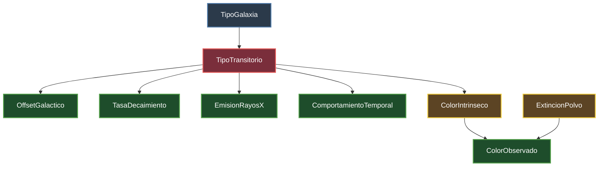

# Documento de Diseño: Sistema de Diagnóstico para Transitorios Astrofísicos

## 1. Planteamiento del Problema
El sistema implementa un modelo causal probabilístico mediante una Red Bayesiana discreta para la clasificación e inferencia diagnóstica de alertas astronómicas transitorias ($X_{\text{trans}}$) bajo condiciones de observación incompleta o ruidosa.

---

## 2. Topología del Grafo Causal (DAG)

### Diagrama Mermaid

---

## 3. Diccionario Formal de Variables y Estados

| Variable | Rol Causal | Espacio de Estados | Fundamento Astrofísico |
| :--- | :--- | :--- | :--- |
| `TipoGalaxia` | Prior contextual | `Espiral_StarForming`, `Eliptica_Pasiva` | Tasa de formación estelar del entorno huésped. |
| `TipoTransitorio` | Hipótesis central | `SN_Ia`, `SN_II`, `AGN`, `Variable` | Clase física del fenómeno emisor. |
| `OffsetGalactico` | Manifestación directa | `Nuclear`, `Periferico` | Separación angular respecto al pozo de potencial gravitatorio central. |
| `TasaDecaimiento`| Manifestación directa | `Rapida`, `Lenta_Meseta` | Gradiente de magnitud temporal post-máximo en la curva de luz. |
| `EmisionRayosX` | Manifestación directa | `Detectada`, `NoDetectada` | Procesos no térmicos de alta energía (discos de acreción / sincrotrón). |
| `ComportamientoTemporal` | Manifestación directa | `Evento_Unico`, `Periodico` | Destrucción cataclísmica terminal vs. variabilidad periódica/estocástica. |
| `ColorIntrinseco` | Proceso emisor | `Azul_Caliente`, `Rojo_Frio` | Temperatura efectiva fotosférica ($T_{\text{eff}}$) según la ley de Wien. |
| `ExtincionPolvo` | Variable ambiental | `Baja`, `Alta` | Densidad de columna de polvo en la línea de visión (dispersión de Rayleigh). |
| `ColorObservado` | Observación final (V) | `Azul_Aparente`, `Rojo_Aparente` | Índice fotométrico registrado en el plano focal del telescopio. |

---

## 4. Justificación de Independencias y Estructura Causal

1. **Dependencias directas desde `TipoTransitorio`:**
   * **`ComportamientoTemporal`:** Las supernovas ($\text{SN}$) corresponden al colapso destructivo irreversible de una estrella (evento único), mientras que $\text{AGN}$ y estrellas variables exhiben actividad persistente o periódica.
   * **`ColorIntrinseco`:** La física del plasma inicial en supernovas y discos de acreción de $\text{AGN}$ supera los $10.000\text{ K}$ (emisión ultravioleta/azul), mientras que variables pulsantes evolucionadas son fotosferas frías (rojas).

2. **Independencia de `ExtincionPolvo`:**
   * La extinción del medio interestelar en la línea de visión es una variable ambiental preexistente; no guarda dependencia causal con el estallido del transitorio.

3. **Estructura en V (*Collider*) y *Explaining Away*:**
   * $X_{\text{c\_int}}$ y $X_{\text{polvo}}$ convergen sobre $X_{\text{c\_obs}}$. 
   * **Sin observación de color:** Ambas variables son marginalmente independientes ($X_{\text{c\_int}} \perp X_{\text{polvo}}$).
   * **Al observar $X_{\text{c\_obs}} = \text{Rojo}$:** El camino causal se desbloquea. Si posteriormente se evidencia $X_{\text{polvo}} = \text{Alta}$, la presencia de polvo «explica» el enrojecimiento fotométrico (*explaining away*), aumentando significativamente la probabilidad de que la fuente sea intrínsecamente caliente ($X_{\text{c\_int}} = \text{Azul}$).

4. **Incompatibilidad morfológica:**
   * Progenitores masivos ($M > 8\,M_\odot$) de $\text{SN\_II}$ tienen tiempos de vida $< 50\text{ Ma}$, inexistentes en galaxias elípticas pasivas: $P(\text{SN\_II} \mid \text{Eliptica}) \approx 0$.

---

## 5. Factorización de la Distribución Conjunta

$$P(V) = P(\text{TG}) \cdot P(\text{TT} \mid \text{TG}) \cdot P(\text{OG} \mid \text{TT}) \cdot P(\text{TD} \mid \text{TT}) \cdot P(\text{RX} \mid \text{TT}) \cdot P(\text{CT} \mid \text{TT}) \cdot P(\text{CI} \mid \text{TT}) \cdot P(\text{EP}) \cdot P(\text{CO} \mid \text{CI}, \text{EP})$$

---
