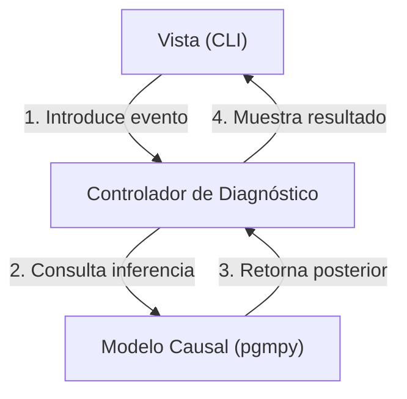

# Especificación Técnica: Arquitectura del Sistema y Diseño de Variables

**Materia:** Razonamiento con Incertidumbre (RAIN) - Grado en Inteligencia Artificial  
**Autores:** Anxo Grandal Lama y Hugo Martínez Estévez  
**Estado:** Documento de diseño preliminar de arquitectura y modelado causal

---

## 1. Justificación y Selección de la Arquitectura

Siguiendo las directrices de diseño para sistemas locales de razonamiento con incertidumbre, se adopta el patrón arquitectural **Modelo-Vista-Controlador (MVC)** para garantizar una separación estricta entre la lógica probabilística y la interfaz de usuario:

* **Modelo (`src/model/TransientModel`):** Encapsula el razonamiento causal implementado con la librería `pgmpy`. Gestiona la definición del grafo (`BayesianNetwork`), la asignación cuantitativa de probabilidades (`TabularCPD`) y los algoritmos de inferencia exacta (`VariableElimination`). No contiene dependencias gráficas ni de entrada/salida.
* **Controlador (`src/controller/DiagnosisController`):** Actúa como coordinador del flujo de trabajo. Recibe las observaciones telescópicas, verifica que los estados introducidos sean válidos, efectúa las consultas de inferencia sobre el modelo y procesa la distribución posterior calculada para su visualización.
* **Vista (`src/view/ConsoleView`):** Interfaz textual interactiva por terminal (CLI) que permite introducir evidencias parciales (propiedades de la galaxia, color observado, detección de alta energía) y presenta los diagnósticos ordenados por probabilidad.

---

---

## 2. Especificación Formal de Variables y Espacios de Estados

El sistema formaliza un espacio de **9 variables discretas**, cuyos rangos de estados son mutuamente excluyentes y exhaustivos para permitir el diagnóstico bayesiano:

| Variable | Rol en la Red | Espacio de Estados Discretos | Justificación Física / Dominio |
| :--- | :--- | :--- | :--- |
| **`Tipo_Transitorio`** | **Nodo Diagnóstico (Objetivo)** | `{SN_Ia, SN_II, AGN, Variable_Estelar}` | Evento físico intrínseco causante del fenómeno que el sistema clasifica. |
| **`Galaxia_Anfitriona`** | Causal (Contexto / Prior) | `{Espiral, Eliptica, Irregular}` | Entorno galáctico; las galaxias elípticas carecen de gas para colapso gravitatorio masivo (impidiendo SN II). |
| **`Ubicacion_Galactica`** | Causal intermedia | `{Nuclear, Brazo_Espiral, Halo}` | Los núcleos galácticos activos (AGN) residen exclusivamente en el centro; las SN II aparecen en brazos espirales de formación. |
| **`Temperatura_Intrinseca`** | Causal física | `{Alta, Media, Baja}` | Mecanismo térmico de emisión propio de la explosión estelar o del disco de acreción. |
| **`Extincion_Polvo`** | Ruido de línea de visión | `{Baja, Moderada, Severa}` | Atenuación física provocada por la dispersión del polvo interestelar entre la fuente y el telescopio. |
| **`Color_Observado`** | Observable (Colisionador) | `{Azul, Neutro, Rojo}` | Efecto conjunto de la temperatura intrínseca alterada por el enrojecimiento del polvo interestelar. |
| **`Emision_RayosX`** | Observable alta energía | `{Intensa, Debil, Nula}` | Firma típica de acreción energética en agujeros negros supermasivos (AGN). |
| **`Velocidad_Expansion`** | Observable cinemático | `{Muy_Alta, Moderada, Baja_Nula}` | Ensanchamiento Doppler en líneas espectrales debido a la eyección de materia en supernovas. |
| **`Forma_Curva_Luz`** | Observable temporal | `{Decaimiento_Rapido, Meseta, Estocastica}` | Patrón fotométrico en el tiempo (meseta prolongada en SN II, caída rápida en SN Ia, variabilidad estocástica en AGN). |

---

## 3. Topología Causal Preliminar (Hacia el DAG Final)

Las relaciones causales directas que estructuran la red bayesiana quedan definidas por la física del dominio:
1. `Galaxia_Anfitriona` $\rightarrow$ `Tipo_Transitorio`
2. `Tipo_Transitorio` $\rightarrow$ `Ubicacion_Galactica`
3. `Tipo_Transitorio` $\rightarrow$ `Temperatura_Intrinseca`
4. `Tipo_Transitorio` $\rightarrow$ `Emision_RayosX`
5. `Tipo_Transitorio` $\rightarrow$ `Velocidad_Expansion`
6. `Tipo_Transitorio` $\rightarrow$ `Forma_Curva_Luz`
7. `{Temperatura_Intrinseca, Extincion_Polvo}` $\rightarrow$ `Color_Observado` *(Estructura en V para modelado de explaining away)*.