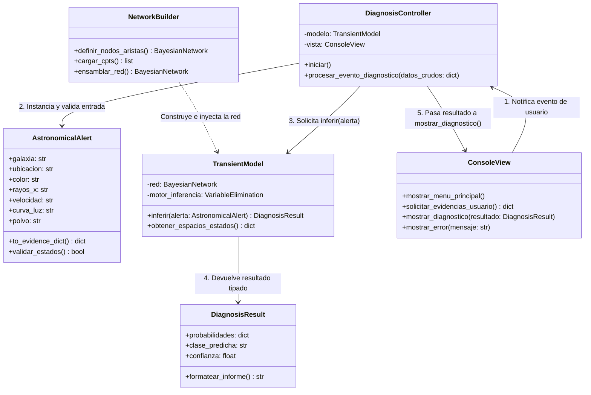
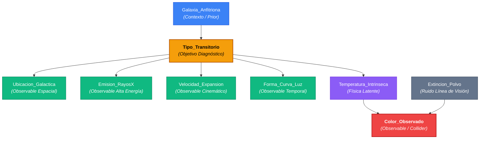

# Especificación Técnica: Arquitectura del Sistema y Diseño de la Red Bayesiana

**Materia:** Razonamiento con Incertidumbre (RAIN) - Grado en Inteligencia Artificial  
**Autores:** Anxo Grandal Lama y Hugo Martínez Estévez  
**Estado:** Documento formal de arquitectura y modelado causal (Hito Sesiones 5 a 7)

---

## 1. Arquitectura del Software: Patrón MVC Modular

Para cumplir con la separación de responsabilidades y permitir la ejecución local desacoplada, la aplicación se estructura bajo el patrón **Modelo-Vista-Controlador (MVC)** organizado en 5 clases:

### 1.1. Responsabilidades y Flujo de Interacción
1. **Entrada de datos (`ConsoleView`):** La vista captura las observaciones del usuario (alertas telescópicas reales o simuladas) y las envía al controlador sin interactuar con la lógica bayesiana.
2. **Validación y mediación (`DiagnosisController` y `AstronomicalAlert`):** El controlador recibe los datos crudos, valida que los estados observados pertenezcan a los dominios físicos permitidos instanciando un objeto tipado `AstronomicalAlert`, y solicita el diagnóstico.
3. **Construcción desacoplada (`NetworkBuilder`):** Aísla la definición matemática y topológica de la red en `pgmpy`, evitando sobrecargar el modelo con definiciones tabulares estáticas.
4. **Motor de inferencia (`TransientModel`):** Resuelve el cálculo probabilístico exacto mediante `VariableElimination` sobre la evidencia observada y empaqueta la distribución posterior en un objeto `DiagnosisResult`.
5. **Presentación de resultados:** El controlador recibe `DiagnosisResult` y le ordena a la vista mostrar el informe ordenado de probabilidades.

---

## 2. Especificación Formal de Variables y Espacios de Estados

El dominio modela **9 variables discretas**, exhaustivas y mutuamente excluyentes, categorizadas según su función dentro del sistema de diagnóstico:

| Variable | Rol en la Red | Espacio de Estados Discretos | Justificación Física / Dominio Astrofísico |
| :--- | :--- | :--- | :--- |
| **`Tipo_Transitorio`** | **Diagnóstico (Objetivo)** | `{SN_Ia, SN_II, AGN, Variable_Estelar}` | Fenómeno físico real subyacente que se desea inferir. |
| **`Galaxia_Anfitriona`** | Contexto Causal (Prior) | `{Espiral, Eliptica, Irregular}` | Entorno galáctico; las galaxias elípticas carecen de gas para colapso gravitatorio masivo (probabilidad nula de SN II). |
| **`Ubicacion_Galactica`** | Causal intermedia | `{Nuclear, Brazo_Espiral, Halo}` | Los núcleos galácticos activos (AGN) se ubican estrictamente en el núcleo; las SN II aparecen en brazos espirales de formación. |
| **`Temperatura_Intrinseca`** | Causal física | `{Alta, Media, Baja}` | Mecanismo térmico de emisión emitido en la fuente antes de sufrir dispersión interestelar. |
| **`Extincion_Polvo`** | Ruido de línea de visión | `{Baja, Moderada, Severa}` | Atenuación física provocada por la dispersión del polvo interestelar entre la fuente y el observador. |
| **`Color_Observado`** | Observable (Colisionador) | `{Azul, Neutro, Rojo}` | Efecto conjunto de la temperatura intrínseca modulada por el enrojecimiento del polvo interestelar. |
| **`Emision_RayosX`** | Observable alta energía | `{Intensa, Debil, Nula}` | Distintivo de procesos de acreción en pozos gravitatorios profundos (agujeros negros supermasivos en AGN). |
| **`Velocidad_Expansion`** | Observable cinemático | `{Muy_Alta, Moderada, Baja_Nula}` | Ensanchamiento Doppler en líneas espectrales debido a la onda de choque expulsada a miles de km/s en supernovas. |
| **`Forma_Curva_Luz`** | Observable temporal | `{Decaimiento_Rapido, Meseta, Estocastica}` | Evolución temporal del brillo (caída lineal rápida en SN Ia, meseta sostenida en SN II, variabilidad estocástica en AGN). |

---

## 3. Topología Causal y Arquitectura de la Red Bayesiana (DAG)

El grafo acíclico dirigido sigue una orientación estricta de causa física a efecto observable:

---

## 4. Factorización de la Distribución Conjunta

Aplicando la regla de la cadena para redes bayesianas, la distribución de probabilidad conjunta global sobre las 9 variables se factoriza como:

$$P(G, T, U, \theta, E, C, X, V, L) = P(G) \cdot P(E) \cdot P(T \mid G) \cdot P(U \mid T) \cdot P(\theta \mid T) \cdot P(X \mid T) \cdot P(V \mid T) \cdot P(L \mid T) \cdot P(C \mid \theta, E)$$

Donde:
* $G$: `Galaxia_Anfitriona`
* $E$: `Extincion_Polvo`
* $T$: `Tipo_Transitorio` (nodo diagnóstico)
* $U$: `Ubicacion_Galactica`
* $\theta$: `Temperatura_Intrinseca`
* $C$: `Color_Observado`
* $X$: `Emision_RayosX`
* $V$: `Velocidad_Expansion`
* $L$: `Forma_Curva_Luz`

---

## 5. Análisis de Independencias Condicionales y Estructuras Causales

* **Estructura en V (*Collider*) y *Explaining Away*:** La confluencia causal $\theta \rightarrow C \leftarrow E$ representa una estructura de colisión. Incondicionalmente, la temperatura física de la fuente y la presencia de polvo interestelar son estocásticamente independientes ($E \perp \theta$). Al condicionar sobre la evidencia observada del colisionador ($C = \text{Rojo}$), las variables parentales se vuelven dependientes: conocer la presencia de alta extinción por polvo ($E = \text{Severa}$) reduce la necesidad de atribuir el color rojo a una temperatura baja, recuperando una alta probabilidad posterior de que la fuente sea intrínsecamente caliente ($\theta = \text{Alta}$).
* **Independencia Condicional de Observables:** Condicionado al tipo real de evento astronómico ($T$), los observables directos son mutuamente independientes entre sí:
  $$(X \perp V \perp L \perp U \perp \theta \mid T)$$
  Esta propiedad reduce la complejidad combinatoria en las CPTs y garantiza la viabilidad computacional de la inferencia exacta con el algoritmo de eliminación de variables.