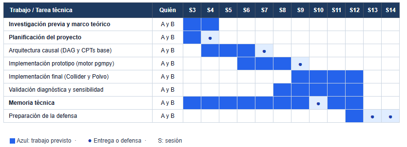

# Planificación del Proyecto: Diagnóstico de Transitorios Astrofísicos

**Materia:** Razonamiento con Incertidumbre (RAIN) - Grado en Inteligencia Artificial
**Autores:** Anxo Grandal Lama y Hugo Martínez Estévez

## 1. Introducción y Objetivos del Proyecto

El objetivo de este proyecto es desarrollar un **Sistema de Diagnóstico** basado en un modelo causal probabilístico capaz de clasificar alertas astronómicas transitorias (como supernovas o AGN). Dado que observamos el universo bajo condiciones incompletas y con ruido, el sistema manejará esta incertidumbre para inferir la naturaleza intrínseca de los eventos astronómicos utilizando una Red Bayesiana implementada con la librería `pgmpy`.

## 2. Metodología de Desarrollo: CommonKADS en Dos Incrementos

Para el diseño del sistema se adopta la metodología **CommonKADS**, estructurada en un ciclo de vida iterativo en **dos incrementos**:

* **Justificación de CommonKADS:** El proyecto consiste en capturar y formalizar **conocimiento experto** astrofísico para resolver un problema de **diagnóstico bajo incertidumbre**. CommonKADS permite desacoplar el modelo conceptual causal (diseño del DAG) de la parametrización matemática (CPTs) antes de programar.
* **Descarte de alternativas:** Se descarta *CRISP-DM* por no tratarse de minería inductiva sobre un gran dataset tabular, y *Scrum* porque los sprints rígidos no se ajustan al calendario docente de dos entregas prefijadas.
* **Articulación en dos incrementos:**
  * **Incremento 1 (Prototipo funcional - S9):** Modelado del núcleo causal básico (tipo de galaxia, clase de transitorio, cinemática y rayos X) con inferencia preliminar demostrable en `pgmpy`.
  * **Incremento 2 (Sistema final - S14):** Ampliación con la estructura en V (*collider* de extinción por polvo interestelar y *explaining away*), validación diagnóstica de robustez y memoria técnica final.

## 3. Metodología de Trabajo Conjunto (50/50)

Para garantizar la máxima cohesión técnica y asegurar que no exista ninguna asimetría en nuestro grado de conocimiento sobre el proyecto, hemos decidido adoptar una metodología de **trabajo 100% conjunto y síncrono** en todas las fases. 

*   **Investigación y Diseño:** Co-autoría en la definición del DAG, el diccionario de variables y la justificación causal astrofísica.
*   **Desarrollo (*Pair Programming*):** La implementación técnica se realizará programando en pareja. Esto asegura que ambos comprendemos cada línea de código, la factorización de la distribución conjunta y los algoritmos de inferencia aplicados, preparándonos para dominar el funcionamiento de la aplicación en la defensa final.
*   **Control de Versiones:** Utilizaremos nuestro repositorio en GitHub (`hugo-martinez-hme/transitorios`) para mantener un registro de nuestros avances.

## 4. Desglose de Tareas Compartidas

Dado nuestro enfoque de responsabilidad compartida integral, **Anxo Grandal y Hugo Martínez actuarán conjuntamente (50/50) en el 100% de las siguientes tareas**:

*   **Fase de Modelado Astrofísico:**
    *   Definición del diccionario formal de variables (Tipo Transitorio, Color Observado, Extinción, etc.).
    *   Diseño del Grafo Causal (DAG) y análisis de independencias condicionales (estructuras en V, *explaining away*).
*   **Fase de Implementación Técnica:**
    *   Configuración del entorno Python y la librería `pgmpy`.
    *   Implementación de la topología del grafo en el código fuente.
    *   Estimación y volcado de las Tablas de Probabilidad Condicional (CPTs).
    *   Desarrollo de casos de prueba (consultas e inferencias sobre el modelo).
*   **Fase de Documentación y Defensa:**
    *   Redacción estructurada de los documentos de Planificación, Arquitectura y Memoria final.
    *   Preparación conjunta de las diapositivas, ensayo de la demostración tecnológica y preparación para la ronda de preguntas.

## 5. Cronograma Detallado y Entregables (Evaluación Continua)

Hemos alineado el desarrollo técnico de nuestra Red Bayesiana con el calendario oficial de Evaluación Continua.

| Semana | Hito / Tarea Principal (Realizada al 50/50) | Entregable Oficial |
| :--- | :--- | :--- |
| **14 - 18 Sep** | Elección del dominio: Diagnóstico Astrofísico con incertidumbre observacional. | **Elección de tema** |
| **28 Sep - 2 Oct** | Elaboración del cronograma y adopción de la metodología de Pair Programming. | **Documento de Planificación** |
| **5 - 9 Oct** | Definición de las 9 variables principales y sus espacios de estados. | Revisión del estado de avance |
| **19 - 23 Oct** | Análisis de independencias, dependencias directas y *explaining away*. | Revisión del estado de avance |
| **26 - 30 Oct** | Justificación del DAG (diagrama Mermaid) y factorización de la conjunta. | **Documento de Arquitectura** |
| **2 - 6 Nov** | Setup de `pgmpy` y programación de las primeras CPTs en pareja. | Revisión del estado de avance |
| **9 - 13 Nov** | Red Bayesiana instanciada en código. Primeras inferencias funcionales demostrables. | **Prototipo Tecnológico (Código Parcial)** |
| **16 - 20 Nov** | Ajuste fino de probabilidades (prior de galaxias, extinción de polvo). | Revisión del estado de avance |
| **23 - 27 Nov** | Propuesta del índice y secciones de la memoria final pactadas con el profesor. | **Estructura de la Memoria** |
| **30 Nov - 4 Dic** | Redacción conjunta de la memoria, revisión de citas y preparación de diapositivas. | Revisión del estado de avance |
| **7 - 18 Dic** | Presentación, demostración del software y respuesta conjunta a preguntas. | **Defensa del proyecto** |
| **18 Dic** | Inclusión del completo desarrollado (`pgmpy`) y entrega definitiva. | **Entrega de la Memoria** |
## Diagrama de Gantt

