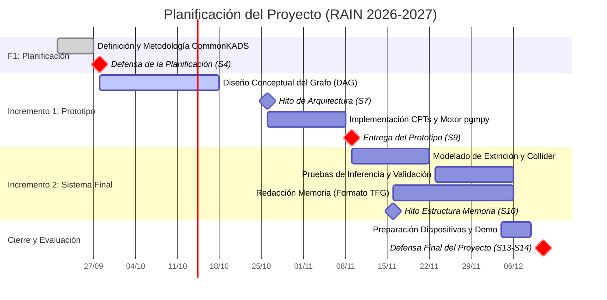

# Planificación y Metodología del Proyecto

**Asignatura:** Razonamiento con Incertidumbre (RAIN)  
**Proyecto:** Sistema de Diagnóstico de Transitorios Astrofísicos mediante Redes Bayesianas  
**Marco de referencia:** Estructura oficial TFG (Secciones 5.9 y 5.10)

---

## 1. Metodología de Desarrollo (Sección 5.9)

Para este proyecto se adopta una adaptación de **CommonKADS** combinada con un ciclo de desarrollo iterativo en **dos incrementos**:

* **Justificación de CommonKADS frente a CRISP-DM o Scrum:**
  * El problema no parte de un conjunto masivo de datos brutos tabulados que requiera minería continua (lo que descartaría la rigidez de CRISP-DM), sino de la **captura, formalización y validación del conocimiento astrofísico experto** (leyes térmicas de radiación, tiempos de vida de progenitores estelares y efectos del medio interestelar).
  * CommonKADS es el estándar metodológico en ingeniería del conocimiento para sistemas de diagnóstico: permite desacoplar el modelo conceptual (el grafo causal DAG) del modelo cuantitativo (las distribuciones de probabilidad condicional o CPTs) antes de pasar a la implementación computacional.
  * La literatura base para la arquitectura probabilística de diagnóstico se fundamenta en las directrices de modelado de modelos gráficos probabilísticos (*Sucar, L. E., Probabilistic Graphical Models: Principles and Applications*, 2.ª ed., Springer, 2021).

* **Estrategia en Dos Incrementos:**
  * **Incremento 1 (Prototipo - Hito Sesión 9):** Construcción del núcleo causal fundamental (galaxia, tipo de transitorio, propiedades cinemáticas y observables de alta energía), definición de CPTs base y validación de inferencia exacta preliminar.
  * **Incremento 2 (Sistema Final - Hito Sesiones 13-14):** Modelado de inter-causalidad mediante la estructura en V (*collider* de extinción por polvo interestelar y *explaining away*), calibración fina de probabilidades, suite completa de pruebas de sensibilidad y memoria final.

---

## 2. Estimación de Esfuerzo y Dedicación (Sección 5.10)

De acuerdo con la guía docente de la asignatura, la carga global está acotada a un máximo de 160 horas-persona por pareja (80 h por estudiante):

* **Criterio de planificación:** Se computan **100 horas-persona de trabajo autónomo** (50 h por integrante) complementadas con **60 horas-persona presenciales** de laboratorio (30 h por integrante), sumando las **160 h-persona totales**[cite: 3].
* **Distribución de roles:**
  * **Estudiante A (Hugo Martínez):** Arquitectura probabilística, formalización del DAG, implementación de CPTs y motor de inferencia (`pgmpy`).
  * **Estudiante B (Compañero):** Análisis de restricciones de dominio, casos de prueba diagnóstica, validación de inferencia y soporte de documentación técnica.
  * *Ambos integrantes participan de forma conjunta en la planificación, integración y preparación de defensas[cite: 3].*

### Desglose de Dedicación por Fases (Horas de Trabajo Autónomo)

| Id | Fase / Paquete de Trabajo | Responsable | Horas A | Horas B | Total (h-p) |
| :--- | :--- | :---: | :---: | :---: | :---: |
| **F1** | **Planificación y Gestión Inicial** | A y B | 6 h | 6 h | 12 h |
| | F1.1 Formalización del alcance y requisitos | A y B | 3 h | 3 h | 6 h |
| | F1.2 Cronograma, Gantt y setup Git/SSH | A y B | 3 h | 3 h | 6 h |
| **F2** | **Incremento 1: Prototipo Funcional** | A y B | 18 h | 18 h | 36 h |
| | F2.1 Formalización conceptual del grafo causal (DAG) | A | 6 h | 4 h | 10 h |
| | F2.2 Parametrización y normalización de CPTs iniciales | A y B | 6 h | 6 h | 12 h |
| | F2.3 Implementación del prototipo con `pgmpy` | A | 4 h | 2 h | 6 h |
| | F2.4 Casos de validación básica de inferencia | B | 2 h | 6 h | 8 h |
| **F3** | **Incremento 2: Sistema Completo y Refinamiento** | A y B | 14 h | 14 h | 28 h |
| | F3.1 Implementación del collider (extinción y *explaining away*) | A | 6 h | 4 h | 10 h |
| | F3.2 Calibración empírica y análisis de consistencia | A y B | 4 h | 4 h | 8 h |
| | F3.3 Pruebas de robustez ante evidencias contradictorias | B | 4 h | 6 h | 10 h |
| **F4** | **Elaboración de la Memoria (Simulación TFG)** | A y B | 8 h | 8 h | 16 h |
| | F4.1 Redacción técnica (arquitectura, diseño y pruebas) | A y B | 5 h | 5 h | 10 h |
| | F4.2 Manual de usuario y justificación de resultados | A y B | 3 h | 3 h | 6 h |
| **F5** | **Preparación de la Defensa Final** | A y B | 4 h | 4 h | 8 h |
| | F5.1 Diapositivas, guion técnico y demostración en vivo | A y B | 4 h | 4 h | 8 h |
| **Total**| **Dedicación no presencial del proyecto** | | **50 h** | **50 h** | **100 h-p** |

---

## 3. Cronograma y Diagrama de Gantt

El calendario se estructura sobre las 14 sesiones semanales de la asignatura[cite: 3]:

### Matriz de Planificación por Sesiones

| Trabajo / Hito | Responsable | S3 | S4 | S5 | S6 | S7 | S8 | S9 | S10 | S11 | S12 | S13 | S14 |
| :--- | :---: | :---: | :---: | :---: | :---: | :---: | :---: | :---: | :---: | :---: | :---: | :---: | :---: |
| **Planificación y Metodología** | A y B | **X** | **D** | | | | | | | | | | |
| **Incremento 1: Prototipo** | | | | | | | | | | | | | |
| └ Arquitectura y Diseño DAG | A y B | | | **X** | **X** | **E** | | | | | | | |
| └ Implementación del Prototipo | A y B | | | | | | **X** | **E** | | | | | |
| **Incremento 2: Entrega Final** | | | | | | | | | | | | | |
| └ Implementación Completa (V-Structure) | A y B | | | | | | | | **X** | **X** | | | |
| └ Pruebas y Análisis de Sensibilidad | A y B | | | | | | | | | **X** | **X** | | |
| └ Memoria Oficial (Estructura TFG) | A y B | | | | | | | | **E** | **X** | **X** | | |
| └ Preparación de la Defensa | A y B | | | | | | | | | | | **X** | **D** |

*Referencias del cronograma:*  
* `X`: Trabajo previsto durante la sesión / semana[cite: 3].  
* `E`: Hito de entrega de avance o prototipo (S7: Arquitectura, S9: Prototipo, S10: Estructura memoria)[cite: 3].  
* `D`: Sesión oficial de defensa (S4: Planificación, S13-S14: Defensa final)[cite: 3].

### Diagrama de Gantt (Mermaid)

---

## 4. Gestión de Riesgos y Planes de Mitigación

1. **Riesgo: Explosión combinatoria en el cálculo de factores.**  
   * *Mitigación:* Se ha limitado el grado de entrada máximo a 2 padres por nodo (`ColorObservado`), preservando un *tree-width* de 2 para garantizar tiempos de inferencia inferiores a 10 ms mediante `VariableElimination`.
2. **Riesgo: Divergencia entre entornos locales de desarrollo.**  
   * *Mitigación:* Aislamiento mediante entornos virtuales (`.venv`), archivo de dependencias congelado (`requirements.txt`), autenticación segura vía SSH y flujo de trabajo centralizado en GitHub.
3. **Riesgo: Dificultad para calibrar valores a priori de fuentes poco frecuentes.**  
   * *Mitigación:* Integración jerárquica de literatura observacional consolidada (frecuencias volumétricas de supernovas y catálogos de variabilidad del ZTF).
